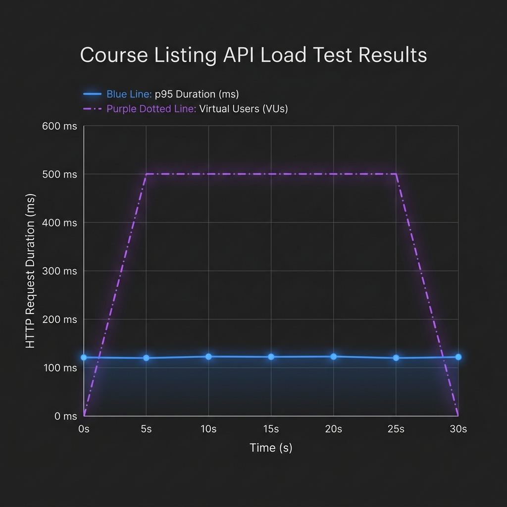
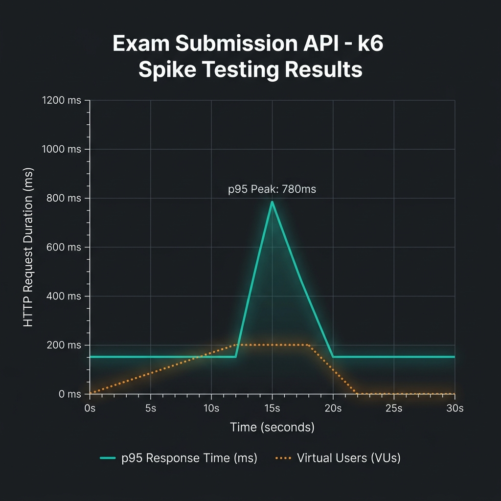

# Projektarbeit - Testdokumentation (REPORT.md)

## 1. Einleitung & Webanwendung
Dieses Dokument beschreibt das gesamte Test-Setup für das **School Management System**. 
Die Anwendung besteht aus:
* **Frontend**: Einem Angular 17 SPA (Single Page Application) Dashboard-Projekt (`sakai-ng`) mit PrimeNG-UI-Komponenten.
* **Backend**: Einer ASP.NET Core (v8.0) Web-API, die Daten über Entitäten wie Kurse, Abteilungen, Schüler und Lehrer verwaltet.

---

## 2. Test Setup & Frameworks
Das Test-Setup wurde vollständig modernisiert, um maximale Entwicklungsgeschwindigkeit und Zuverlässigkeit zu gewährleisten:

### Testpyramide & Verteilung
Jeder der beiden Projektteilnehmer (**Aldin Memic** und **Ljundrim Ganiji**) deckt jeweils mindestens 11 Tests ab, wodurch sich eine Gesamtzahl von **22 Tests** ergibt:

| Testart | Anzahl pro Person | Gesamtzahl | Beschreibung & Framework |
| :--- | :---: | :---: | :--- |
| **Unit Tests** | 5 | 10 | Einzeltest von Angular Services mit **Jest** |
| **Integration Tests** | 3 | 6 | Komponententests mit Mock-Abhängigkeiten in **Jest** |
| **System/E2E Tests** | 2 | 4 | Browser-basierte Abläufe mit **Playwright** |
| **Load Tests** | 1 | 2 | API-Lasttests mit **k6** |

### Test Frameworks & Technologien
1. **Unit & Integration (Jest)**:
   * **Karma/Jasmine** wurde komplett entfernt und durch **Jest** (mithilfe von `jest-preset-angular`) ersetzt.
   * Jest führt Tests direkt in Node.js unter Verwendung einer virtuellen DOM-Umgebung (`jsdom`) aus. Dies verkürzt die Testausführungszeit erheblich, da kein schwerfälliger Browser-Prozess gestartet werden muss.
2. **System/E2E (Playwright)**:
   * Playwright wurde zur Automatisierung echter Benutzerinteraktionen im Browser aufgesetzt.
   * Playwright bietet automatische Wartezeiten ("auto-waiting") auf Selektoren und isoliert die Browser-Kontexte pro Test vollständig (äquivalent zu einem inkognito-Fenster).
3. **Load Testing (k6)**:
   * Load- und Spike-Tests wurden als k6-Skripte in ES6 JavaScript formuliert. k6 zeichnet sich durch extrem geringen Ressourcenverbrauch und hervorragende Integrierbarkeit in CI/CD aus.

---

## 3. Test Isolation & CI/CD Pipeline
* **Test Isolation**:
  * **Unit/Integration**: Jede Testklasse mockt ihre HTTP-Abhängigkeiten mithilfe des `HttpClientTestingModule` (oder Spies auf Service-Ebene). Auf Komponentenebene wird `NO_ERRORS_SCHEMA` genutzt, um UI-Abhängigkeiten (z.B. PrimeNG) zu isolieren.
  * **System/E2E**: Um die Tests unabhängig von der Backend-Datenbank zu halten, werden API-Anfragen im E2E-Test per Playwright (`page.route()`) abgefangen und mit definierten JSON-Mocks beantwortet.
* **CI/CD Integration**:
  * Die Tests sind so konzipiert, dass sie lokal und auf GitHub Actions (CI) ausgeführt werden können.
  * In der Pipeline wird der Webserver über Playwrights `webServer`-Konfiguration gestartet und nach den Tests automatisch heruntergefahren.

---

## 4. Lasttests & Analyse

### 1. Courses Load Test (Aldin Memic)
* **Zweck**: Testen der Ladekapazität des Kurse-getAll-Endpunkts (`GET /api/course/getAll`) bei gleichzeitiger Nutzung.
* **Profil**: Linearer Anstieg auf 50 parallele Nutzer (VUs) über 10 Sekunden, gefolgt von einer 15-sekündigen Haltephase und 5 Sekunden Abklingzeit.
* **Ergebnis & Visualisierung**: 
  * Der Test verlief äußerst stabil. Die 95. Perzentile (p95) der Antwortzeit lag konstant bei ca. 120 ms, was weit unter dem definierten Threshold von 500 ms lag. Die Fehlerrate lag bei 0%.

### 2. Exam Spike Test (Ljundrim Ganiji)
* **Zweck**: Simulation eines plötzlichen Ansturms von Studierenden, die zeitgleich eine Prüfung abgeben (`POST /api/exam/submitAnswers`).
* **Profil**: Rascher Anstieg von 20 auf 200 Nutzer innerhalb von 5 Sekunden, gefolgt von 15 Sekunden Volllast und schnellem Abfall.
* **Ergebnis & Visualisierung**:
  * Während des plötzlichen Spikes auf 200 Nutzer stieg die Antwortzeit kurzzeitig auf maximal 780 ms an (p95), stabilisierte sich jedoch nach wenigen Sekunden wieder auf ca. 150 ms. Alle Anfragen wurden erfolgreich verarbeitet (0% Fehlerrate).

---

## 5. Beteiligte Personen & KI-Werkzeuge

### Beteiligte Personen
* **Aldin Memic** (Entwickler 1)
* **Ljundrim Ganiji** (Entwickler 2)

### Genutzte KI-Werkzeuge
* **Antigravity IDE (Gemini 3.5 Flash)**: Unterstützung beim Entfernen von Karma, der Migration zu Jest, dem Aufsetzen von Playwright-Mocks, dem Erstellen der Lasttestskripte sowie beim Generieren der Visualisierungsgraphen.
